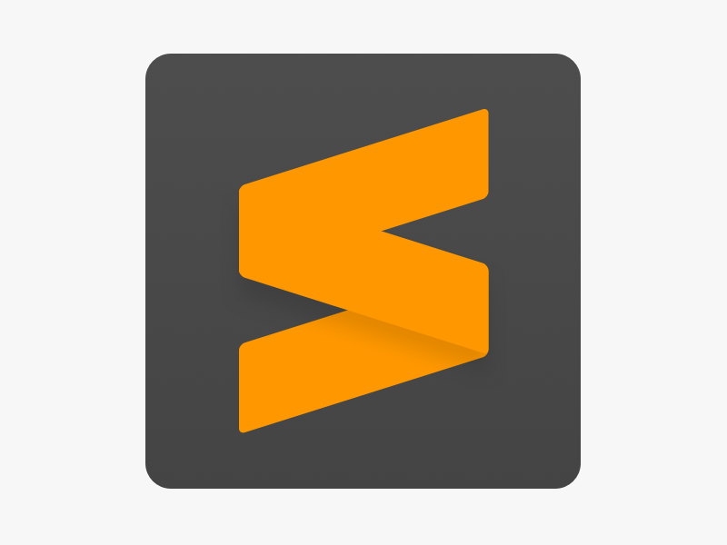
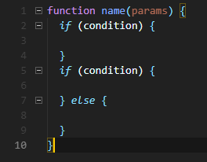
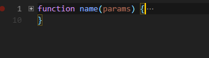
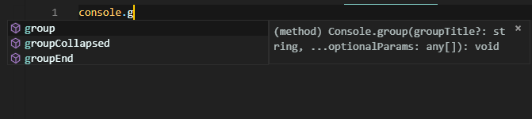
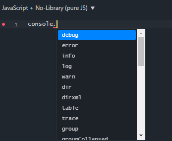

<h1 align="center">Editores de Código</h1>

 
 

<h2 align="center">Práctica de Desarrollo Web en Entorno Cliente</h2>

<h2 align="center">Instalación y configuración de un entorno de trabajo para programar con JavaScript</h2>

 
 
 

    
    
    

 
 
 
 
 

<h2 align="center">1-DAWA</h2>

<h2 align="center">Franz Josué Ramírez Villca</h2>

<h1 align="center">Indice</h1>

3.- Enunciado y Objetivos.

4.- Editores de Codigo.

5.- Visual Studio Code.                  

8.- Sublime Text 3.

10.- JSFiddle.

11.- Eleccion de editor de codigo.

12.- Validación de la página de Talented Europe.

 
 
 
 
 
 
 
 
 
 
 
 
 
 
 
 
 
 
 
 
 
 
 
 
 
 
 
 
 
 
 

## Enunciado

Se pide:

Para ello tendrás que buscar e instalar en tu sistema operativo (cuando sea posible) 3 editores de páginas web, de los cuales, uno de ellos debe ser un editor online. Todas las aplicaciones que instales tendrán que ser gratuitas y tendrás que explicar las razones por las que has elegido dichos editores web de entre los que hayas encontrado.

        • Multilenguaje
        • Chequeo de la sintáxis del lenguaje
        • Formateo del código (espaciado o identación, etc...)
        • Selección o agrupación de bloques de código (funciones, etc...)
        • Emparejamiento de llaves
        • Autocompletado
        • Atajos de teclado
        • Paquetes que pueden instalarse y cuáles recomendarías
        • SSOO en los que puede instalarse o usarse. En el caso del editor web navegadores soportados

Usando la dirección de validación del W3C lleva a cabo la validación de la página de Talented Europe e indica los tipos de errores encontrados, cita 3 errores diferentes detectados y la solución propuesta a cada uno de ellos.

## Objetivos

    El objetivo de la práctica es conocer distintos editores de texto que tenemos para poder progrmas con javascript de manera eficiente y rapida, ya que tienen multitud de herramientas que nos pueden ayudar a la hora de escribir codigo correctamente y mas rapida, acomodandose a nuestras necesidades y gustos.

    Aprendera usar el validador de paginas de la W3C y corregir errores.

 
 
 
 
 
 
 
 
 
 
 
 

# Editores de Codigo.

En este apartado veremos una muy breve introducción a los editores de codigo que hemos elegido.

## Visual Studio Code.  

Es un editor de codigo creado por Microsoft, es de codigo abierto y en la actualidad, uno de los mas usados. 
Esta creado con Electron que es una herramienta para crear aplicaciones multiplataforma de escritorio con tecnologias como JS, CSS, HTML.

## Sublime Text 3.  

Es un editor de codigo creado con Python, por lo que en la actualidad es el editor de codigo mas rapido.
Aunque es un software de pago, puedes usarlo gratuitamente, y no tienes niguna restriccion de funcionalidad, solo que te saldra algunas veces una pequeña pantalla informativa para que compres una licencia.

## JSFiddle.  

Podriamos presentarlo como un "editor de codigo" online, aunque la definicion que nos da Wikipedia es la siguiente: "Es una comunidad en línea para probar y mostrar fragmentos de códigos HTML, CSS y JavaScript creados por el usuario y colaborativos", pero para el proposito de la práctica, es una muy buena opción.

 
 
 
 
 
 
 
 
 
 
 
 
 
 
 
 
 
 
 
 
 
 
 
 
 

# Visual Studio Code.

En primer lugar tenemos a este robusto editor de codigo, primero empezaremos viendo cuales son las funcionalidaes que tiene repecto a lo que se nos pide.

### Multilenguaje:

Este editor soporta 36 lenguajes de programación, entre ellos podemos mencionar C#, Java, Python, C, C++ y obviamente Javascript.

### Chequeo de la sintáxis del lenguaje:

Esta funcionalidad tambien se encuentra por defecto en nuestro editor, si alguna vez cometemos algun error de sintáxis de codigo, este nos lo subrayara con una linea roja.

### Formateo del código (espaciado o identación, etc...):

Tiene soporte para algunos lenguajes, pero si necesitas formatear un codigo javascript necesitas descargar una extension.

### Selección o agrupación de bloques de código (funciones, etc...):

Cuando tenemos bloques de codigo, como condicionales o métodos grandes tenemos el problema de que nos ocupan espacio de vision y tenemos que estar subiendo y bajando constantemente entre lineas de codigo, visual studio code nos permite agrupar estos bloques de codigo de forma que evitamos movernos demas entre las distintas lineas.

 
 

### Emparejamiento de llaves:

Tambien tenemos esta funcionalidad que nos subraya la llave de apertura o de cierre si nos podemos el curso al final de alguna de ellas. 

### Autocompletado:

Tenemos soporte para autocompletar el codigo que vayamos escribiendo, como por ejemplo mientras vamos escribiendo nos dan ayuda de distintos métodos, clases que existen en el lenguaje de programacion.

### Atajos de teclado:

Tenemos distintos atajos de teclado, como por ejemplo: copiar una linea arriba o abajo, comentar una linea de codigo, mover una linea, etc.

### Paquetes que pueden instalarse y cuáles recomendarías:

Como estamos configurando nuestro editor para trabajar con Javascript, veremos extensiones para el mismo lenguaje.

##### JavaScript (ES6) code snippets

Esta extensión contiene snippets para javascript en el estandat ES6.

Esto quiere decir que por ejemplo si nosotros queremos escribir en "console.log()" podriamos hacerlo de la siguiente manera: escribimos clo y pulsamos <strong>TAB</strong> ynos completara toda la sentencia.

##### ESLint

Esta extencion nos permite escribir código javascript eficientemente con el minimo esfuerzo, puedes aplicar muchos estilos javascript para escribir tu codigo javascript, entre ellos el Standard, Google, Airbnb.

NOTA: Un estilo o guia de estilo es la forma en la que nosotros escribimos nuestro codigo.

### SSOO en los que puede instalarse o usarse. En el caso del editor web navegadores soportados:

En este caso Visual Studio Code se puede usar en Linux, Windows y macOS.

 
 
 
 
 
 
 
 
 
 
 
 
 
 
 
 
 
 
 
 
 
 
 
 
 

# Sublime Text 3.

Este es uno de los editores de codigo mas rapidos, veamos las funcionalidades que nos trae.

### Multilenguaje:

Al igual que Visual Studio Code, soporta muchos lenguajes de programacion.

### Chequeo de la sintáxis del lenguaje:

Esta funcionalidad tambien se encuentra por defecto en nuestro editor, si alguna vez cometemos algun error de sintáxis de codigo, este nos marca la line donde ocurre el error.

### Formateo del código (espaciado o identación, etc...):

Lo puedes hacer en la pestaña de Edit -> Line -> Reindent.

 
 

### Selección o agrupación de bloques de código (funciones, etc...):

Cuando tenemos bloques de codigo, como condicionales o métodos grandes tenemos el problema de que nos ocupan espacio de vision y tenemos que estar subiendo y bajando constantemente entre lineas de codigo, visual studio code nos permite agrupar estos bloques de codigo de forma que evitamos movernos demas entre las distintas lineas.

### Emparejamiento de llaves:

Tambien tenemos esta funcionalidad que nos subraya la llave de apertura o de cierre si nos podemos el curso al final de alguna de ellas. 

### Autocompletado:

Tenemos soporte para autocompletar el codigo que vayamos escribiendo, como por ejemplo mientras vamos escribiendo nos dan ayuda de distintos métodos, clases que existen en el lenguaje de programacion.

### Atajos de teclado:

Tenemos distintos atajos de teclado, como por ejemplo: copiar una linea arriba o abajo, comentar una linea de codigo, mover una linea, etc.

### Paquetes que pueden instalarse y cuáles recomendarías:

Como estamos configurando nuestro editor para trabajar con Javascript, veremos extensiones para el mismo lenguaje.

Las mismas extensiones que descargamos en Visual Studio Code, tambien las tenemos en Sublime Text 3.

##### JavaScript snippets

Esta extensión contiene snippets para javascript en el estandat ES6.

Esto quiere decir que por ejemplo si nosotros queremos escribir en "console.log()" podriamos hacerlo de la siguiente manera: escribimos clo y pulsamos <strong>TAB</strong> ynos completara toda la sentencia.

##### ESLint

Esta extencion nos permite escribir código javascript eficientemente con el minimo esfuerzo, puedes aplicar muchos estilos javascript para escribir tu codigo javascript, entre ellos el Standard, Google, Airbnb.

        Un estilo o guia de estilo es la forma en la que nosotros escribimos nuestro codigo.

### SSOO en los que puede instalarse o usarse. En el caso del editor web navegadores soportados:

En este caso se puede usar en Linux, Windows y macOS.

 

# JSFiddle.

Este es un "editor de codigo" online.

### Multilenguaje:

Puedes usar Html, Css y Javascript.

### Chequeo de la sintáxis del lenguaje:

Tiene un buen suporte para la verificacion de sintaxis, y nos va mostrando pequeños circulos a lado de las numeraciones de las lineas de codigo, y nos subraya la linea.

### Formateo del código (espaciado o identación, etc...):

Lamentablemente no podemos formatear un codigo como en los anteriores editores de codigo, pero tenemos lo típico, identecion con tabulacion o con espacion.

### Selección o agrupación de bloques de código (funciones, etc...):

Cuando tenemos bloques de codigo, como condicionales o métodos grandes tenemos el problema de que nos ocupan espacio de vision y tenemos que estar subiendo y bajando constantemente entre lineas de codigo, visual studio code nos permite agrupar estos bloques de codigo de forma que evitamos movernos demas entre las distintas lineas.

 
 

### Emparejamiento de llaves:

Tambien tenemos esta funcionalidad que nos subraya la llave de apertura o de cierre si nos podemos el curso al final de alguna de ellas. 

### Autocompletado:

Tenemos soporte para autocompletar el codigo que vayamos escribiendo, como por ejemplo mientras vamos escribiendo nos dan ayuda de distintos métodos, clases que existen en el lenguaje de programacion.

### Atajos de teclado:

No dipone de atajos de teclado.

### Paquetes que pueden instalarse y cuáles recomendarías:

En este caso no podemos instalarle extensiones.

### Navegadores web soportados:

Testeando un poco funciona en los principales navegadores, Edge, Mozilla, Chrome.

 
 

# Eleccion de editor de codigo

Podriamos decir que Visual Studio Code es una mejor opcion a elegir, ya que consta de las siguientes ventajas:

    • Codigo Abierto
    • Un mejor funcionamiento para con frameworks front-end.
    • Gran variedad de plugins
    • Esta hecho por Microsoft

 
 
 
 

# Validación de la página de Talented Europe.

Al hacer la validación de la página nos encontramos con varios errores, desde errores de atributos HTML y mala semantica. Nos pondremos con tres de estos y veremos las posibles soluciones ocurrentes.

### Primer Error:

    Este hace referencia a un error en el atributo de la etiqueta principal html, deberiamos poner el siguiente atributo lang="en" ya que la página esta en ingles, dependiendo de si el contenido de la pagina, pondremos uno u otra abreviación de un idioma.

### Segundo Error:

    El error explica que en la etiqueta "ul" no esta permitido usar el rol="nav" ya que no es algo que el estandar permita.
    Para resolver este problema deberiamos poner el rol="navigation" a la etiqueta "nav".

Como referencia esta el siguiente enlace: http://w3c.github.io/html/single-page.html#the-ul-element

### Tercer Error:

    En este caso es un error muy sencillo, simplemente hay que quitar el valor true al atributo loop, ya que este no tiene ningun atributo y basta con ponerlo para que se sobreentienda que es lo que desea que haga el navegador con el video.
