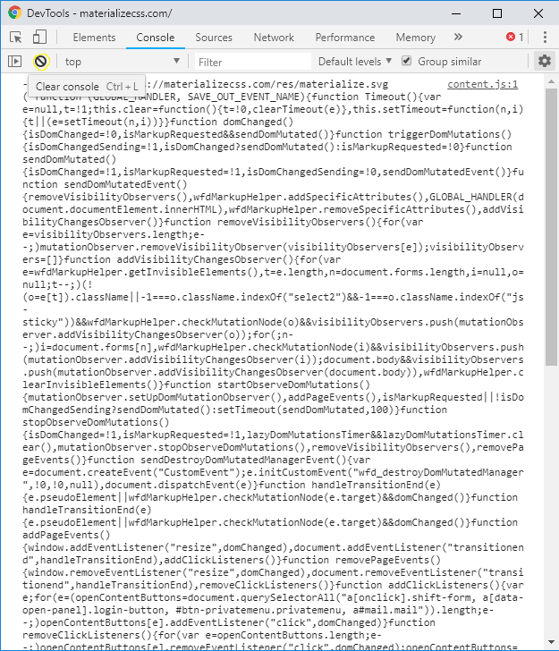
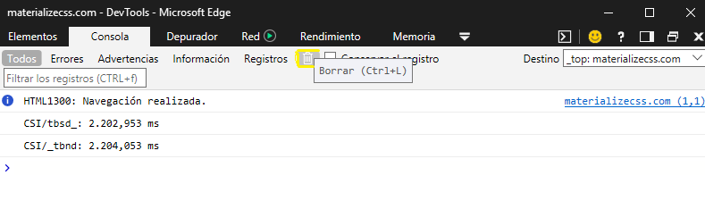
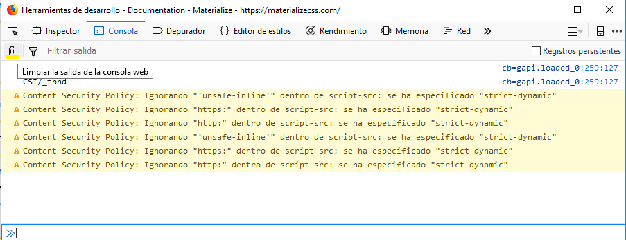

<h1 align="center">Herramientas de Desarrollo</h1>

 
 

<h2 align="center">Práctica de Desarrollo Web en Entorno Cliente</h2>

<h2 align="center">Conociendo las herramientas para desarrolladores de los navegadores</h2>

 
 
 

    

 
 
 
 
 
 
 
 
 
 
 
 
 
 
 
 
 
 
 
 
 

<h2 align="center">1-DAWA</h2>

<h2 align="center">Franz Josué Ramírez Villca</h2>

<h1 align="center">Indice</h1>

3.- Enunciado.

4.- Herramienta de Consola.

10.- Depuracion de aplicacion que calcula el exponencial de un número.

22.- Navegador Preferido.

 
 
 
 
 
 
 
 
 
 
 
 
 
 
 
 
 
 
 
 
 
 
 
 
 
 
 
 
 
 
 
 
 
 
 
 
 

## Enunciado

Se pide:

Parte 1

    Utilizando los navegadores Firefox, Chrome y Edge, localizar abre la herramienta Consola. Dichas consolas probablemente mostrarán muchos avisos relativos a todos los errores que ha ido encontrando el navegador en las páginas que hayas ido visitando desde que lo iniciaste.

    Utiliza el botón "Limpiar" para borrar dichos errores y mensajes de aviso; a continuación, recarga alguna de las páginas que estés visitando y comprueba qué nuevos errores han aparecido en la consola de errores. Filtra para mostrar únicamente los errores. 

    Deberás documentar los pasos realizados y explicar la información obtenida.

Parte 2

    Aquí tienes un programa sencillo que calcula el exponencial de un número. 

    Puedes descargarte el código aquí.

    1) Ejecútalo en el navegador Chrome. Proporciona el dígito que te solicita. ¿Que ha ido mal?

    Establece un punto de ruptura en el código de la función, recarga la web y vuelva a introducir los dígitos. Monitoriza el valor de las variables a y n del formulario y utiliza la opción adecuada para trazar el programa y ver cómo varían los valores para detectar donde se ha producido el error. 

    Ten en cuenta que a medida que se pasa por las llamadas a las funciones recursivas, el subpanel "Call Stack" de la derecha te permite realizar un seguimiento de la pila de llamadas, junto con los parámetros que se pasan en cada llamada a la función.

    2) ¿Podrías solucionar el problema que presenta el código que se te ha proporcionado?

    3) Repite la actividad en los navegadores Firefox y Edge usando el código original. ¿Qué herramienta prefieres? Razona la respuesta, evaluando pros y contras de cada una de ellas.

 
 
 

# Herramienta de Consola.

Aqui iremos viendo la herramienta de consola en los distintos navegadores web.

## Google Chrome.  

Primeramente debemos abrir las herramientas de desarrolador, para ello debemos pulsar <strong>F12</strong> o hacer click derecho en la página e hacer click en la opcion <strong>Inspeccionar</strong>.

Se nos mostrara una pantalla de la siguiente forma.

Dentro de esa misma ventada, nos encontraremos con varias pestañas, la que nosotros usaremos es la de <strong>Console</strong>, una vez ahi limpiaremos la ventana haciendo click en el siguiente icono o boton.

Aclarar que en la pagina que estamos visitando, solo nos salen errores de javascript.

Ahora veremos que tambien podemos filtrar por Errores, Advertencias, Informacion. En este caso filtraremos para que solo nos aparezcan errores de la pagina que visitamos.

    Para poder filtrar en Chrome nos vamos al mini menu despegable a la derecha de "Filter" y seleccionamos solo la opcion "Errors" y las demas las quitamos.

## Microsoft Edge.  

Primeramente debemos abrir las herramientas de desarrolador, para ello debemos pulsar <strong>F12</strong> o hacer click derecho en la página e hacer click en la opcion <strong>Inspeccionar</strong>.

Se nos mostrara una pantalla de la siguiente forma.

Dentro de esa misma ventada, nos encontraremos con varias pestañas, la que nosotros usaremos es la de <strong>Console</strong>, una vez ahi limpiaremos la ventana haciendo click en el siguiente icono o boton.

Aclarar que en la pagina que estamos visitando, solo nos salen errores de javascript.

Ahora veremos que tambien podemos filtrar por Errores, Advertencias, Informacion. En este caso filtraremos para que solo nos aparezcan errores de la pagina que visitamos.

    Para poder filtrar por Errores en edge tenemos un pequeño menu dentro de nuestra pestaña de Console, donde seleccionaremos la opcion de Errores.

## Mozilla Firefox.  

Primeramente debemos abrir las herramientas de desarrolador, para ello debemos pulsar <strong>F12</strong> o hacer click derecho en la página e hacer click en la opcion <strong>Inspeccionar</strong>.

Se nos mostrara una pantalla de la siguiente forma.

Dentro de esa misma ventada, nos encontraremos con varias pestañas, la que nosotros usaremos es la de <strong>Console</strong>, una vez ahi limpiaremos la ventana haciendo click en el siguiente icono o boton.

Aclarar que en la pagina que estamos visitando, solo nos salen errores de javascript.

Ahora veremos que tambien podemos filtrar por Errores, Advertencias, Informacion. En este caso filtraremos para que solo nos aparezcan errores de la pagina que visitamos.

    En este navegador tenemos que pulsar un el boton que esta a lado de la etiqueta de "Filtrar salida", se nos abrirar un menu abajo donde podremos marcar las distintas opciones por las que queremos filtrar, seleccionamos unicamente Errores.

 
 
 
 
 
 
 
 
 
 
 
 
 
 
 
 
 
 

# Depuracion de aplicacion que calcula el exponencial de un número.

A partir de una pequeña aplicacion hecha en Javascript realizaremos distintas actividades de Depuracion y Correccion del código.

### Probando y Depurando la aplicacion en Google Chrome:

Al probar la aplicacion y darle al boton calcular, no se realiza la operacion.

Ahora realizaremos la depuracion del codigo para ver lo que esta ocurriendo.

Abrimos las herramientas de desarrollo y nos vamos a la pestaña de "sources", ahi encontraremos todos el archivo HTML que contiene el javascript a depurar.

Pondremos un punto de interrupcion en el boton de calcular, para hacerlo simplemente hacemos click en el numero de la linea.

Ahora cuando le hagamos click en el boton de calcular iniciara la depuracion, una vez iniciada nos resaltara la linea donde pusimos el punto de interrupcion y ahora a la derecha podemos ver distintos botones que nos permiten avanzar en el codigo, ademas de pestañas donde podemos ir viendo el valor de las variables, pilla de llamadas, etc.

Avanzaremos en el código usando <strong>F11</strong> esto nos permitira poder entrar dentro de la funcion que estamos llamando actualmente.

Primeramente vemos que dentro de la ventana de código nos llevo a la funcion javascript que estabamos llamando al pulsar el boton.

Y Despues vemos que la ventana de depuracion que se actualizo y nos muestra el valor de las variables que le estamos pasando a la funcion, y tambien vemos en la funcion que nos encontramos actualmente.

Verificando los datos introducidos vemos que todo esta correcto, pero a la hora de ver el código de la función, vemos que lo que hace es llamar una y otra vez a esta funcion, lo que hara que nos de el siguiente error llamado 
<strong>Maximum call stack size exceeded</strong>

    Aqui vemos que es lo que va pasando mientras seguimos avanzando en la depuracion usando F11

### Resolviendo el Error:

Cambiaremos un poco el código para poder resolver de una forma el ejercicio. 

Quedara de la siguiente forma:

Con esto podremos calcular el exponencial de un numero,
multiplicando "n" veces el numero que nos den.

Y ahora podemos ver como nos funciona correctamente el programa. y no nos lanza niggun error en consola.

 
 
 
 
 
 

### Probando y Depurando la aplicacion en Mozilla Firefox:

Ahora realizaremos la depuracion con las herramientas que nos proporciona Firefox.

Abrimos las herramientas de desarrollo y nos vamos a la pestaña de "Depurador", ahi encontraremos todos el archivo HTML que contiene el javascript a depurar y seleccionamos el nuestro.

Pondremos un punto de interrupcion en el boton de calcular, para hacerlo simplemente hacemos click en el numero de la linea.
En este caso, a diferencia de Chrome, Firefox no nos deja poner el punto de interrupcion en una linea con código HTML, solo en javascript.

Ahora cuando le hagamos click en el boton de calcular iniciara la depuracion, una vez iniciada nos resaltara la linea donde pusimos el punto de interrupcion y ahora a la derecha podemos ver distintos botones que nos permiten avanzar en el codigo, ademas de pestañas donde podemos ir viendo el valor de las variables, pilla de llamadas, etc.

Avanzaremos en el código usando <strong>F11</strong> esto nos permitira poder entrar dentro de la funcion que estamos llamando actualmente.

Como Vemos que la ventana de depuracion que se actualizo y nos muestra el valor de las variables que le estamos pasando a la funcion, y tambien vemos en la funcion que nos encontramos actualmente.

Verificando los datos introducidos vemos que todo esta correcto, pero a la hora de ver el código de la función, vemos que lo que hace es llamar una y otra vez a esta funcion, lo que hara que nos de el siguiente error llamado 
<strong>too much recursion</strong>

### Resolviendo el Error:

Lo resolveremos de la misma forma que lo hicimos en el apartado de Google Chrome.

Quedara de la siguiente forma:

Con esto podremos calcular el exponencial de un numero,
multiplicando "n" veces el numero que nos den.

Y ahora podemos ver como nos funciona correctamente el programa. y no nos lanza niggun error en consola.

 
 
 
 
 
 

### Probando y Depurando la aplicacion en Microsoft Edge:

Ahora realizaremos la depuracion con las herramientas que nos proporciona Edge.

Abrimos las herramientas de desarrollo y nos vamos a la pestaña de "Depurador", ahi encontraremos todos el archivo HTML que contiene el javascript a depurar y seleccionamos el nuestro.

Pondremos un punto de interrupcion en el boton de calcular, para hacerlo simplemente hacemos click en el numero de la linea.

Ahora cuando le hagamos click en el boton de calcular iniciara la depuracion, una vez iniciada nos resaltara la linea donde pusimos el punto de interrupcion y ahora a la derecha podemos ver distintos botones que nos permiten avanzar en el codigo, ademas de pestañas donde podemos ir viendo el valor de las variables, pilla de llamadas, etc.

Avanzaremos en el código usando <strong>F11</strong> esto nos permitira poder entrar dentro de la funcion que estamos llamando actualmente.

Como Vemos que la ventana de depuracion que se actualizo y nos muestra el valor de las variables que le estamos pasando a la funcion, y tambien vemos en la funcion que nos encontramos actualmente.

Verificando los datos introducidos vemos que todo esta correcto, pero a la hora de ver el código de la función, vemos que lo que hace es llamar una y otra vez a esta funcion, lo que hara que nos de el siguiente error llamado .

<strong>Out of stack space</strong>

    Como nota: en los otros navegadores al depurar usando F11 nos permitia seguir una y otra vez dentro de la misma funcion, pero en Edge no nos lo permite, haciendo que una vez nos llamemos a nosotros mismo como funcion, pare la depuracion y salte el error en consola.

### Resolviendo el Error:

Lo resolveremos de la misma forma que lo hicimos en el apartado de Google Chrome.

Quedara de la siguiente forma:

Con esto podremos calcular el exponencial de un numero,
multiplicando "n" veces el numero que nos den.

Y ahora podemos ver como nos funciona correctamente el programa. y no nos lanza niggun error en consola.

 
 
 
 
 
 
 
 
 
 
 
 
 
 
 
 
 
 
 
 
 
 

# Navegador Preferido:

Como ya vimos las distintas herramientas de desarrollo de los navegadores, vamos a seleccionar nuestro navegador preferido.

Tenemos a Google Chrome que es uno de los tres navegadores mas usados y que tiene muchas herramienas de desarrollo utiles para poder realizar nuestras actividades, como desarrollador web.  

Los tres grandes navegadores son muy completos en cuanto a herramientas de desarrollo, unas funcionan mejor que otras pero en general son muy buenas, pero por uso personal y familiaridad, mi navegador preferido es Google Chrome, tiene una herramienta de la que no disponen los demas, que es <strong>Audits</strong>. Te permite hacer un testeo de como funciona tu pagina en cuanto a performance, si tienes una buena semantica en el código HTML, Accesibilidad, etc. 

Aunque debo mencionar que para verificacion de codigo CSS, con tecnologias tales como CSS Grid, Flexbox, Firefox es una mejor eleccion.